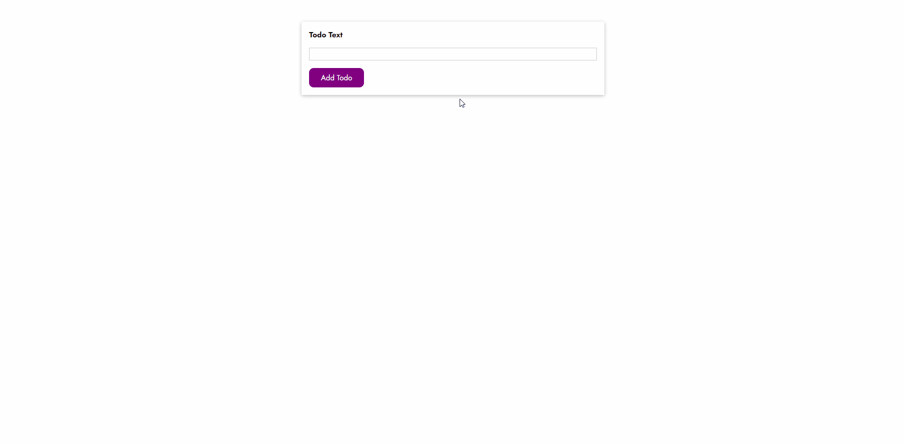

## Deno / React / MongoDB TODO app

Simple TODO, fetch, add, update and delete items.

## Built With

- [Deno](https://deno.land/) - JavaScript/TypeScript runtime
- [Oak](https://github.com/oakserver/oak) - Middleware framework kinda like Express
- [React.js](https://reactjs.org/) - Frontend framework
- [MongoDB](https://www.mongodb.com/) - Database

## DEMO



## Installation

_Make sure to have [Git](http://git-scm.com/), [Node.js](http://nodejs.org/) 10.0.0 (or higher) and [Deno](https://deno.land/) 1.5.0 (or higher) installed._

1. Clone it or fork it.

2. Once you have your local copy, install the frontend dependencies using either Yarn:

```
cd frontend-app && yarn
```

or npm:

```
cd frontend-app && npm install
```

or the best:

```
cd frontend-app && pnpm install
```

3. For the backend create an .env file under ``/deno`` with the following properties according to your MongoDB configuration:

```
DB_USER=*
DB_NAME=*
DB_PASS=*
```

## Running

After installed, you can start the frontend by running it with Yarn:

```
cd frontend-app && yarn start
```

or npm:

```
cd frontend-app && npm run start
```

or pnpm:

```
cd frontend-app && pnpm start
```

And the backend with Deno:

```
cd deno && deno run --unstable --allow-net --allow-env --allow-read --allow-write --allow-plugin app.ts
```

<!-- (if you didn't change the `PORT` property on `.env`) -->

## Meta

Gustavo Máximo – [gmaximo.dev](https://gmaximo.dev)